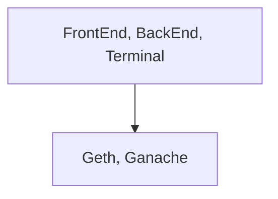
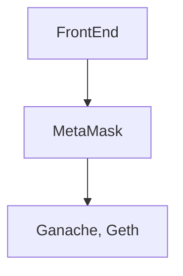
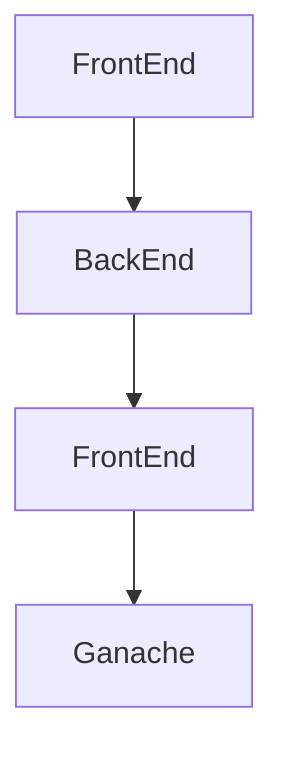
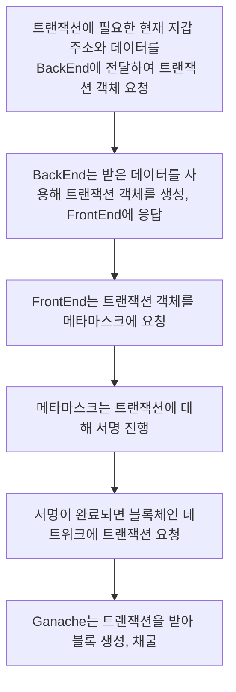

# 블록체인 네트워크 정리
## - Geth란?
- 블록체인 네트워크 서버
- Genesis 블록부터 설정 가능
- IPC를 사용하여 접근 가능
- RPC를 설정하여 메서드 사용 가능
- 다른 피어에 동기화 가능
  - Chain ID로 같은 블록체인 네트워크인지 확인
- attach 명령어로 블록체인 네트워크에 접근 가능
<br/><br/>

## - Ganache란?
- 테스트가 바로 가능할 정도로 블록체인 네트워크 생성이 자동화 되어있음
- 다른 피어를 찾지 않음
  - 같은 블록체인 네트워크여도 동기화 하지 않음
- 자동 채굴
  - 트랜잭션을 받으면 즉각적인 적용이 가능
- 기본적으로 모든 내부 지갑 계정이 unlock 되어있음
<br/><br/>

# 트랜잭션 보내는 방법
## 1. Geth attach 명령어를 사용하여 블록체인 네트워크에 접근
- IPC 또는 HTTP, WS 등 블록체인 네트워크에 직접 접근(접속)하여 RPC를 사용
- 블록체인 네트워크 내에서 트랜잭션을 바로 추가
```bash
geth attach http://localhost:8545
eth.sendTransaction({from:eth.accounts[0], to:eth.accounts[1], value:web3.toWei(1, "ether")})
```

## 2. CURL 명령어를 사용하여 API 요청
- Windows CMD | PowerShell 등에서 CURL 명령어를 사용
- RPC와 유사하지만 중첩되게 사용할 수 없다.
  - 위(attach를 통한 접근)에서는 eth.sendTransaction과 eth.accounts를 한 줄(한번)에 사용 가능하지만 아래 CURL에서는 불가능
```bash
curl -X POST -H "content-type: application/json" --data '{"id":1335, "jsonrpc":"2.0", "method":"eth_sendTransaction", "params":[{"from":"0x~~~", "to":"0x~~~", "value":"0x~~~"}]}' http://localhost:8545
```

## 3. AXIOS 라이브러리를 사용하여 API 요청(create)
- HTML, React 등에서 사용하는 방법
- curl과 유사
```js
axios.post("http://localhost:8545", {
    id : 1337,
    jsonrpc : "2.0",
    method : "eth_sendTransaction",
    params : [
        {
            from:"0x~~~", 
            to:"0x~~~", 
            alue:"0x~~~"
        }
    ]
});
```

## 4. Web3를 사용하여 API 요청
- 블록체인 네트워크에 맞게 구현된 라이브러리
```js
web3.eth.sendTransaction({from:"0x~~~", to:"0x~~~", value:"0x~~~"});
```


# 트랜잭션을 보내기 위한 네트워크 접근 방식 
## 1. 블록체인 네트워크에 바로 접근
- Geth attach 등등


## 2. Matamask를 사용하여 접근
```js
const web3 = new Web3(window.ethereum);
```


## 3. BachEnd 서버를 사용하여 접근

- 스마트 컨트랜트 데이터를 숨길 수 있다.
  - Counter.json에 모든 컨트랙트 정보가 저장되어있는데, 이 것을 프론트에서 사용하지는 않고 백엔드에 저장해놓는다.
  - 프론트는 어떤 메서드를 사용할 것인지, 정보를 보내주고
  - 백엔드에서 사용하게 되면 프론트 쪽에서는 무슨 소리인지 모를 16진수를 받게 되고, 우리가 어떤 코드를 적었는지 숨길 수 있게 된다.
  - 해당 파일은 DB에 따로 저장하지 않고 파일로 저장해 놓는다고 한다.



